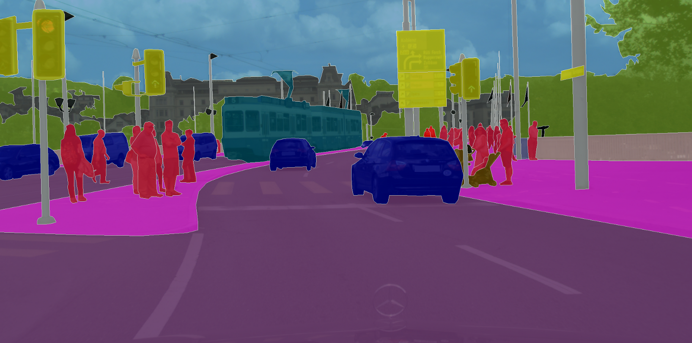

## Efficient-Segmentation-Networks
[![python-image]][python-url]
[![pytorch-image]][pytorch-url]

This project aims at providing an easy-to-use, modifiable reference implementation for real-time semantic segmentation models using PyTorch.

<p align="center"></p>
---

### Table of Contents:
- <a href='#Requirements'>Requirements</a>
- <a href='#Models'>Models</a>
- <a href='#Dataset-Setting'>Dataset Setting</a>
- <a href='#Usage'>Usage</a>
- <a href='#Contact'>Contact</a>

### Requirements

 [**PyTorch**](https://pytorch.org/) and [**Torchvision**](https://pytorch.org/) needs to be installed before running the scripts,  PyTorch v1.1 or later is supported. 

```bash
pip3 install -r requirements.txt
```

### Models

The project supports these semantic segmentation models as follows:
- (**SQNet**) Speeding up Semantic Segmentation for Autonomous Driving [[Paper]](https://openreview.net/pdf?id=S1uHiFyyg)
- (**LinkNet**)  Exploiting Encoder Representations for Efficient Semantic Segmentation [[Paper]](https://arxiv.org/pdf/1707.03718.pdf)
- (**SegNet**)  A Deep Convolutional Encoder-Decoder Architecture for Image Segmentation [[Paper]](https://arxiv.org/pdf/1511.00561.pdf)
- (**UNet**)  Convolutional Networks for Biomedical Image Segmentation [[Paper]](https://arxiv.org/pdf/1505.04597.pdf)
- (**ENet**)  A Deep Neural Network Architecture for Real-Time Semantic Segmentation [[Paper]](https://arxiv.org/pdf/1606.02147.pdf)
- (**ERFNet**)  Efficient ConvNet for Real-time Semantic Segmentation [[Paper]](http://www.robesafe.uah.es/personal/eduardo.romera/pdfs/Romera17iv.pdf)
- (**EDANet**)  Efficient Dense Modules of Asymmetric Convolution for Real-Time Segmentation [[Paper]](https://arxiv.org/ftp/arxiv/papers/1809/1809.06323.pdf)
- (**ESPNet**)  Efficient Spatial Pyramid of Dilated  Convolutions for Semantic Segmentation [[Paper]](https://arxiv.org/pdf/1803.06815v2.pdf)
- (**ESPNetv2**)  A Light-weight, Power Efficient, and General Purpose ConvNet [[Paper]](https://arxiv.org/pdf/1811.11431.pdf)
- (**LEDNet**)  A Lightweight Encoder-Decoder Network for Real-Time Semantic Segmentation [[Paper]](https://arxiv.org/pdf/1905.02423v3.pdf)
- (**FSSNet**)  Fast Semantic Segmentation for Scene Perception [[Paper]](https://ieeexplore.ieee.org/stamp/stamp.jsp?tp=&arnumber=8392426)
- (**ESNet**)  An Efficient Symmetric Network for Real-time Semantic Segmentation [[Paper]](https://arxiv.org/pdf/1906.09826v1.pdf)
- (**CGNet**)  A Light-weight Context Guided Network for Semantic Segmentation [[Paper]](https://arxiv.org/pdf/1811.08201.pdf)
- (**Fast-SCNN**)  Fast Semantic Segmentation Network [[Paper]](https://arxiv.org/pdf/1902.04502.pdf)
- (**DABNet**)  Depth-wise Asymmetric Bottleneck for Real-time Semantic Segmentation [[Paper]](https://arxiv.org/pdf/1907.11357.pdf)
- (**ContextNet**)  Exploring Context and Detail  for Semantic Segmentation in Real-time [[Paper]](https://arxiv.org/pdf/1805.04554.pdf)
- (**FPENet**) Feature Pyramid Encoding Network for Real-time Semantic Segmentation [[Paper]](https://arxiv.org/pdf/1909.08599v1.pdf)
- ...

#### Losses

 The project supports these loss functions: 

> 1. Weighted Cross Entropy
> 2. Weighted Cross Entropy with Label Smooth
> 3. Focal Loss
> 4. Ohem Cross Entropy
> 5. [LovaszSoftmax](https://github.com/bermanmaxim/LovaszSoftmax)
> 6. [SegLoss-List](https://github.com/JunMa11/SegLoss)
> 7. ...

#### Optimizers

 The project supports these optimizers: 

> 1. SGD
> 2. Adam 
> 3. AdamW 
> 4. [RAdam](https://github.com/LiyuanLucasLiu/RAdam)
> 5. RAdam + Lookahead
> 6. ...

#### Activations

> 1. ReLu
> 2. PReLU
> 3. ReLU6
> 4. Swish
> 5. [Mish](https://github.com/digantamisra98/Mish) : A Self Regularized Non-Monotonic Neural Activation Function
> 6. ...

#### Learning Rate Scheduler

The project supports these LR_Schedulers: 

> 1. Poly decay
> 2. Warmup Poly  
> 3. ...

#### Normalization methods

> 1. [In-Place Activated BatchNorm](https://github.com/mapillary/inplace_abn)
> 2. [Switchable Normalization](https://github.com/switchablenorms/Switchable-Normalization)
> 3. [Weight Standardization](https://github.com/joe-siyuan-qiao/WeightStandardization)
> 4. ...

#### Enhancing Semantic Feature Learning Method

> 1. [Attention Family](https://github.com/implus/PytorchInsight)
> 2. [NAS Family](https://github.com/D-X-Y/NAS-Projects)
> 3. ...

#### Some useful Tools

> 1. [pytorch-OpCounter](https://github.com/Lyken17/pytorch-OpCounter)
> 2. [flops-counter.pytorch](https://github.com/sovrasov/flops-counter.pytorch) 
> 3. [Netron](https://github.com/lutzroeder/Netron) : Visualizer for neural network models, On line URL: [Netron](https://lutzroeder.github.io/netron/)
> 4. [Falshtorch](https://github.com/MisaOgura/flashtorch): Visualization toolkit for neural networks in PyTorch !
> 5. [Bag of Tricks for Image Classification with Convolutional Neural Networks](https://github.com/weiaicunzai/Bag_of_Tricks_for_Image_Classification_with_Convolutional_Neural_Networks)
> 6. ...

### Dataset-Setting

This project has been tailored to suit the [Cityscapes](https://www.cityscapes-dataset.com/) and  [CamVid](http://mi.eng.cam.ac.uk/research/projects/VideoRec/CamVid/)  datasets. The folds of your dataset need satisfy the following structures: 

```
|-- dataset
|  |-- camvid
|  |  |-- train
|  |  |-- trainannot
|  |  |-- val
|  |  |-- valannot
|  |  |-- test
|  |  |-- testannot
|  |  |-- ...
|  |-- cityscapes
|  |  |-- leftImg8bit
|  |  |  |-- train
|  |  |  |-- val
|  |  |  |-- test
|  |  |-- gtFine
|  |  |  |-- train
|  |  |  |-- val
|  |  |  |-- test
|  |  |-- ...
```

- You can download [**cityscapes**](https://www.cityscapes-dataset.com/)  dataset from [here](https://www.cityscapes-dataset.com/downloads/). Note: please download [leftImg8bit_trainvaltest.zip(11GB)](https://www.cityscapes-dataset.com/file-handling/?packageID=4) and [gtFine_trainvaltest(241MB)](https://www.cityscapes-dataset.com/file-handling/?packageID=1).
- You can download [**camvid**](http://mi.eng.cam.ac.uk/research/projects/VideoRec/CamVid/) dataset from [here](https://github.com/alexgkendall/SegNet-Tutorial/tree/master/CamVid).
- The **Cityscapes dataset scripts** for inspection, preparation, and evaluation can download from [here](https://github.com/mcordts/cityscapesScripts).

### Usage

#### Clone this Repo

```
git clone https://github.com/xiaoyufenfei/Efficient-Segmentation-Networks
cd Efficient-Segmentation-Networks
```

Currently, the code supports [Python 3](https://www.python.org/)

 Torch dependencies: 

- [PyTorch](https://pytorch.org/) (>=1.1.0)
- torchvision(>=0.3.0)

Data dependencies:

- [Cityscapes](https://www.cityscapes-dataset.com/) + [scripts](https://github.com/mcordts/cityscapesScripts)

Download Cityscapes and run the script `createTrainIdLabelImgs.py` to create annotations based on the training labels. Make sure that the folder is named *cityscapes*

##### Training
- For Cityscapes / CamVid

1. training on **train** set

```
python train.py  --help
```

2. training on **train+val** set

```
python train.py --help
```

##### Testing
- For Cityscapes / CamVid

```
python test.py --help
```

##### Predicting
- For Cityscapes

```
python predict.py --help
```

##### Evaluating
- For Cityscapes

```
cd tools
python trainID2labelID.py 
```

### Contact

If you think this work useful, please give me a star! And if you find any errors or have any suggestions, please contact me.

**GitHub:** `xiaoyufenfei`
**Email:** `wangy314159@163.com`

### Refer to this Rep

You are encouraged to cite the following papers if this work helps your research.

```bash
@misc{Efficient-Segmentation-Networks,
  author = {Yu Wang},
  title = {Efficient-Segmentation-Networks Pytorch Implementation},
  year = {2019},
  publisher = {GitHub},
  journal = {GitHub repository},
  howpublished = {\url{https://github.com/xiaoyufenfei/Efficient-Segmentation-Networks}},
  commit = {master}
}
```

### License

This project is released under the MIT License. See [LICENSE](https://github.com/xiaoyufenfei/Efficient-Segmentation-Networks/blob/master/LICENSE) for additional details.


[python-image]: https://img.shields.io/badge/Python-3.x-ff69b4.svg
[python-url]: https://www.python.org/
[pytorch-image]: https://img.shields.io/badge/PyTorch-1.1-2BAF2B.svg
[pytorch-url]: https://pytorch.org/

